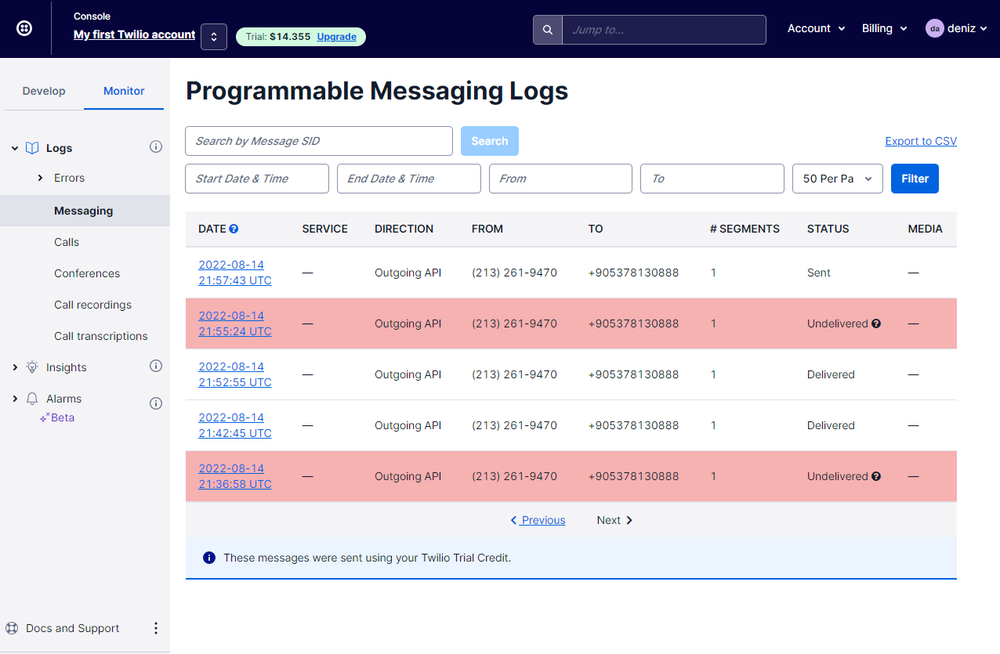
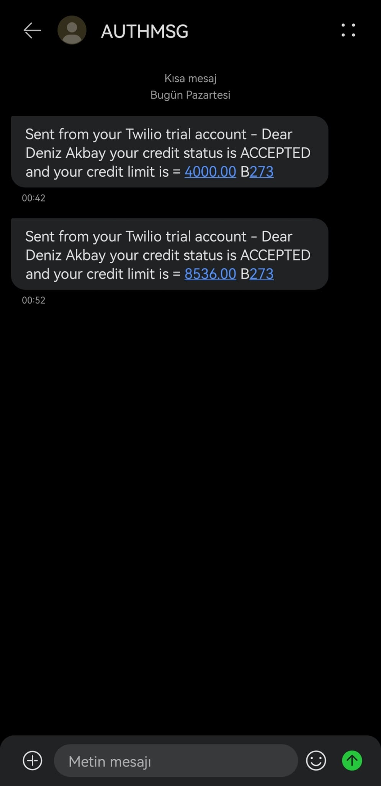
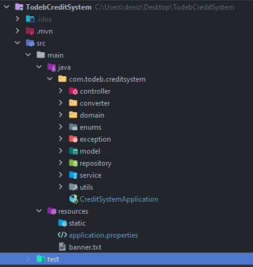
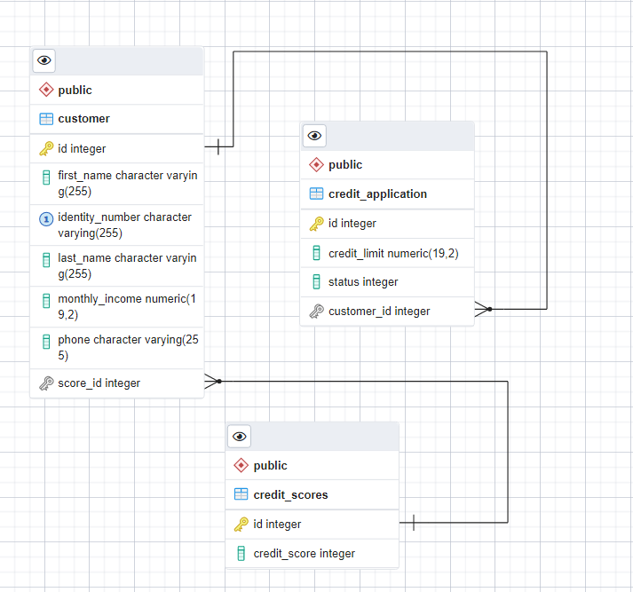
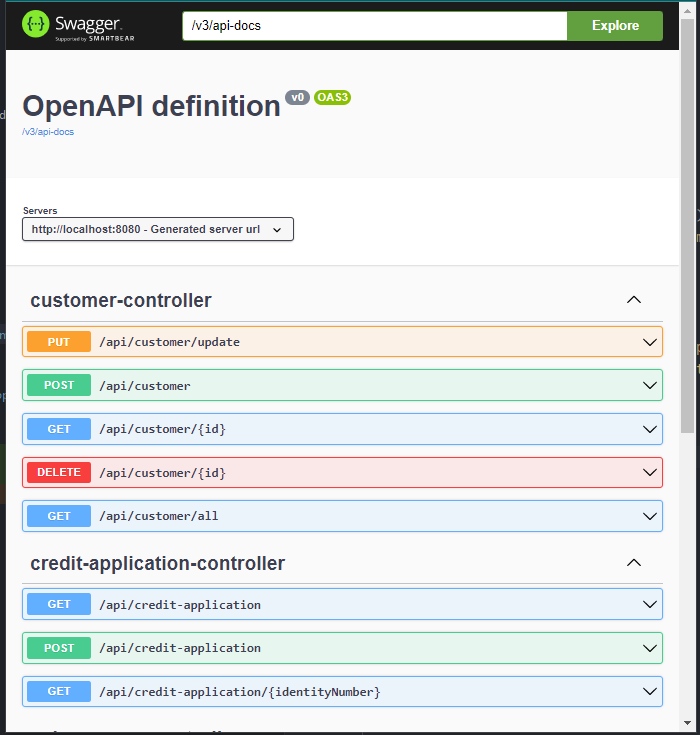

# PATİKA.DEV - TODEB JAVA SPRING BOOTCAMP GRADUATIN PROJECT
___

This  project is a Credit System Project.


### SUBJECT

---
For a loan application system, we receive loan application requests and submit them to the customer according to the relevant criteria.
Spring Boot framework of a restful application that will be included in the service that returns the credit result
writing using.

### REQUIREMENTS

--- 
* By obtaining the user's identity number, name surname, monthly income, and telephone information, the credit score service, which is assumed to have been written before, is accessed with the identity number, And the credit score of the relevant person is taken and the credit result is shown to the user according to certain rules. (There may be two options Accepted or Rejected.)

* New customers can be created in the system, created customers can log in, and customers can be deleted or updated.

* If the credit score is below 500, the user will be rejected. (Credit result: rejected)

* If the credit score is between 500 points and 1000 points and if the monthly income is below 5000 TL
  The user's loan application is approved and a limit of 10,000 TL is assigned to the user. (Credit
  Result: Accepted)

* If the credit score is between 500 points and 1000 points and if the monthly income is above 5000 TL
    The user's loan application is approved and a limit of 20,000 TL is assigned to the user. (Credit
    Result: Accepted)
* MONTHLY INCOME INFORMATION to the user if the credit score is equal to or above 1000 points * CREDIT
    Limit is assigned as much as LIMIT MULTIPLIER. The credit limit multiplier is 4 by default. (Credit Result: Accepted) 
* As a result of the conclusion of the loan, the relevant application is recorded in the database. Afterward, a notification SMS is sent to the relevant phone number and confirmation status from the endpoint
  information (Reject or Accepted), limited information is returned.

* A completed loan application can only be queried with an national ID number.


###  TECHNOLOGIES

---
- Spring Boot 
- Maven 
- JDK 18
- Lombok
- PostgreSQL
- JUnit
- Docker
- Swagger UI

### System Features

---
##### Customer Controller Features :

```
POST  localhost:8080/api/customer (returns customer input.)
```

```
GET  localhost:8080/api/customer/all (returns all customer information.)
```

```
GET  localhost:8080/api/customer/{id} (Returns a customer's information.)
```

```
DELETE  localhost:8080/api/customer/{id} (Deletes a customer's information.)
```

```
PUT  localhost:8080/api/customer?id=1 (Updates customer information)
```

##### Credit Controller Features :

```
POST  localhost:8080/api/credit-application?identityNumber=1111111110 (Customers apply for a loan with their ID numbers.)
```

```
 GET  localhost:8080/api/credit-application/11111111110 (The person applying for the loan according to the ID number is returned.)
```

```
GET  localhost:8080/api/credit-application (credit applicants can be listed)
```


### Twilio
I used [Twilio](https://www.twilio.com/try-twilio?utm_source=google&utm_medium=cpc&utm_term=twilio&utm_campaign=Sitelink-G_S_EMEA_Brand_DACH_EN_NV&cq_plac=&cq_net=g&cq_pos=&cq_med=&cq_plt=gp&gclid=Cj0KCQjw3eeXBhD7ARIsAHjssr8cFPvD9_KwKBh4LoeB8yNmHBAx0Hike0JK6Sz7UolY780BBrW6npcaAh8BEALw_wcB) for sending credit application result via SMS.
Twilio is a modern communication API Used by developers for establishing communications.
Twilio can be used to send SMS, WhatsApp, Voice, Video, email, and even IoT, across the customer journey.
All you need to do is integrate its API with your software.

* status is printed on the site after sending a message to the phone



* The SMS I got on my phone after applying for a loan:




### PROJECT HIERARCHY
### Installing & Running

#### Clone this repo into your local:

```
git clone https://github.com/denizakbay/xxxxx.git
```

####  Build using maven

```
mvn clean install
```

#### Start the app

```
mvn spring-boot:run
```

#### Access the Home screen

The application will be available at the URL: [Home](http://localhost:8080).


## Docker
First you need to uncomment this line in application.properties;

```
* spring.profiles.active=docker
```

Start Docker Engine in your machine.

```
Run mvn clean install.

Build executable jar file - mvn clean package

Build Docker image - docker build -t todeb-credit-system:v1 .

Run Docker container using the image built - docker run -p 8080:8080 todeb-credit-system:v1
```
---



### ENTITY RELATIONSHIP DIAGRAM

---




### API Documentation

---
* API documentation can be accessed via Swagger UI




### Running The Test Cases

---

Test cases for this project

- CreditApplicationRepositoryTest
- CreditScoreRepositoryTest
- CustomerRepositoryTest
- CustomerServiceImplTest

We can run it either from:

Command line
```
mvn test
```
